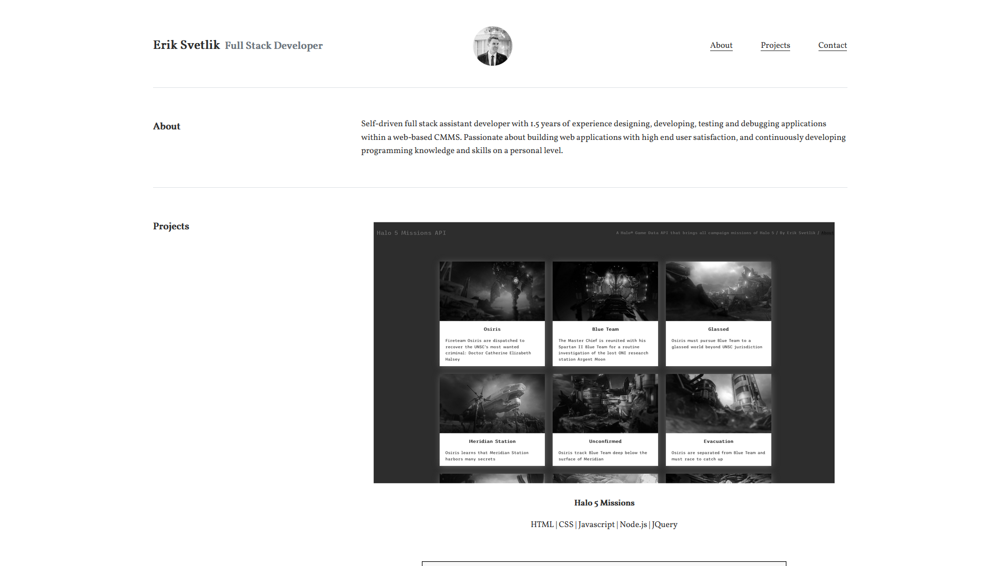

# Description

In this assignment, our task was to create a personal portfolio to include information about us, a showcase of our work, and our contact information.

The main objective of this homework was to utilize skills we’ve learned recently, including flexbox, media queries, and CSS variables.

    - For flex box, I designed the main sections of this portfolio in two columns. The first column includes the title for the section, while the second column includes the content of the section.
    - For media queries, I included a max-width for various screen sizes to keep the width of the page smaller and easier to read. For phone screens, flex box also easily allowed me to set the columns on top of each other.
    - For CSS variables, I utilized a primary color for fonts of various elements, allowing me to quickly change the font color of the entire portfolio if ever needed.

I also believe a portfolio should be representative of you, so minimalism was my aim for this project. At first glance, the entire website is simple black and white, however hovering over links and images will produce a variety of colors. There’s always more than just what meets the eye, right?

HTML | CSS

# Screenshot

# Link

(https://eriksvetlik.github.io/02-homework/)
